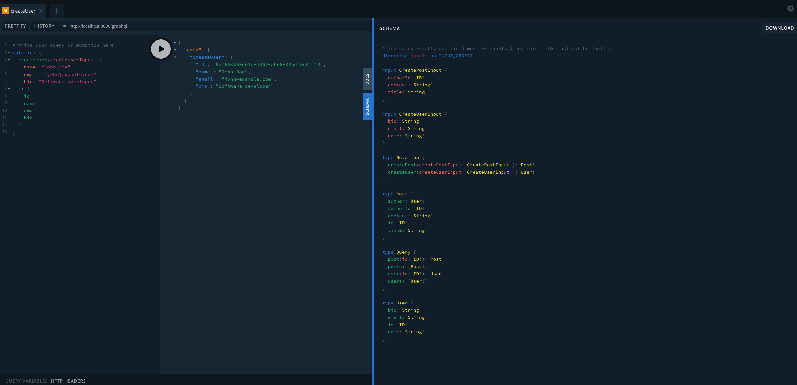
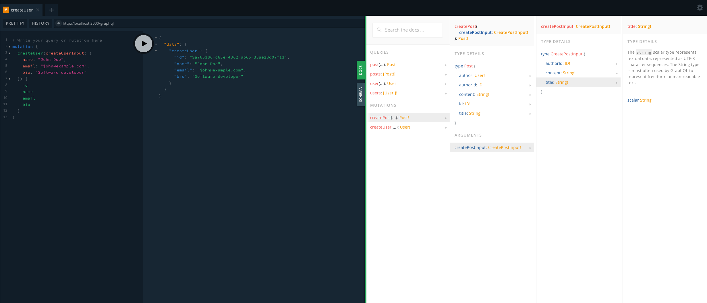

## Description

[Nest](https://github.com/nestjs/nest) framework TypeScript starter repository.

## Project setup

```bash
$ npm install
```

## Compile and run the project

```bash
# development
$ npm run start

# watch mode
$ npm run start:dev

# production mode
$ npm run start:prod
```

```
Application is running on: http://localhost:3000
Swagger documentation: http://localhost:3000/api
GraphQL Playground: http://localhost:3000/graphql
```

## Run tests

```bash
# unit tests
$ npm run test

# e2e tests
$ npm run test:e2e

# test coverage
$ npm run test:cov
```

## Graph QL Playground

### Create User Post



### Sample Docs


